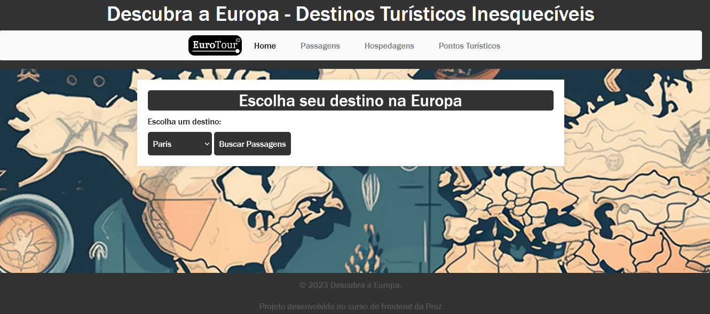
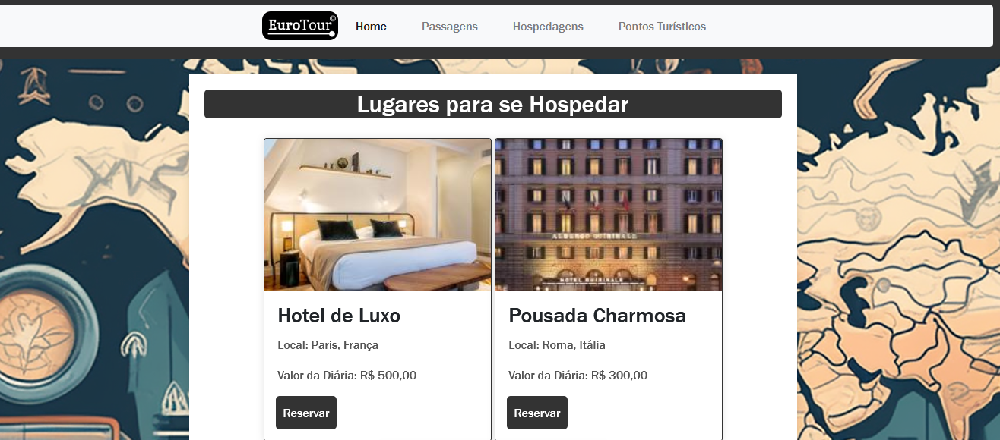

# Descubra a Europa

Bem-vindo ao projeto "Descubra a Europa - Destinos Turísticos Inesquecíveis". Este projeto apresenta informações sobre alguns dos destinos turísticos mais incríveis na Europa, destacando suas belezas e atrações.

## Link
https://descubra-a-europa.netlify.app/
## Imagens


## Tecnologias Utilizadas

- HTML5
- CSS3
- JavaScript
- jQuery

## Conteúdo

- [Instalação](#instalação)
- [Uso](#uso)
- [Contribuição](#contribuição)
- [Licença](#licença)

## Instalação

1. **Clone o Repositório:**
    ```bash
    git clone https://github.com/seu-usuario/descubra-a-europa.git
    ```

2. **Navegue até o Diretório:**
    ```bash
    cd descubra-a-europa
    ```

3. **Abra o Arquivo HTML:**
    Abra o arquivo `index.html` em seu navegador preferido.

## Uso

Explore os destinos turísticos na Europa por meio da interface amigável. Utilize os botões de navegação nas seções para visualizar as imagens e informações de cada destino.

**Elementos de Slide:**
- Para navegar entre as imagens, utilize os botões de seta (&#10094; e &#10095;).
- Cada seção representa um destino turístico, com uma galeria de imagens para destacar as atrações.

## Contribuição

Sinta-se à vontade para contribuir para o projeto! Se você deseja adicionar novos destinos, melhorar o design ou corrigir bugs, siga os passos abaixo:

1. Faça um fork do projeto.
2. Crie uma branch para sua feature (`git checkout -b feature/nova-feature`).
3. Faça commit de suas mudanças (`git commit -am 'Adiciona nova feature'`).
4. Faça push para a branch (`git push origin feature/nova-feature`).
5. Abra um pull request.

## Licença

Este projeto está licenciado sob a [Licença MIT](LICENSE). Consulte o arquivo `LICENSE` para obter mais detalhes.

---

**© 2023 Descubra a Europa.** Projeto desenvolvido no curso de frontend da Proz.
